# Entity Framework (EF) Core

- [Entity Framework (EF) Core](#entity-framework-ef-core)
  - [Defining a Model](#defining-a-model)
    - [EF Core conventions](#ef-core-conventions)
    - [EF Core annotation attributes](#ef-core-annotation-attributes)
    - [EF Core Fluent API](#ef-core-fluent-api)
    - [**Configuring nonrelational properties**](#configuring-nonrelational-properties)
      - [Setting database column type, size, and nullability](#setting-database-column-type-size-and-nullability)
      - [The different ways of configuring the primary key](#the-different-ways-of-configuring-the-primary-key)
        - [Configuring a primary key via Data Annotations](#configuring-a-primary-key-via-data-annotations)
        - [Configuring a primary key via the Fluent API](#configuring-a-primary-key-via-the-fluent-api)
      - [Adding indexes to database columns](#adding-indexes-to-database-columns)
      - [Excluding properties and classes from the database](#excluding-properties-and-classes-from-the-database)
        - [Excluding a class or property via Data Annotations](#excluding-a-class-or-property-via-data-annotations)
        - [Excluding a class or property via Fluent API](#excluding-a-class-or-property-via-fluent-api)
    - [**Configuring relationships**](#configuring-relationships)
      - [Defining some relationship terms](#defining-some-relationship-terms)
        - [What navigational properties do you need?](#what-navigational-properties-do-you-need)
      - [Configuring relationships By Convention](#configuring-relationships-by-convention)
        - [One-to-Many Relationship](#one-to-many-relationship)
        - [One-to-One Relationship](#one-to-one-relationship)
        - [Many-to-Many Relationship](#many-to-many-relationship)
      - [Creating an instance of the application’s DbContext](#creating-an-instance-of-the-applications-dbcontext)
  - [CRUD](#crud)
    - [CREATE](#create)
      - [Non-Relational](#non-relational)
        - [creating single principal record](#creating-single-principal-record)
        - [creating principal record in bulks](#creating-principal-record-in-bulks)
      - [Relational](#relational)
        - [(1-m) Create dependent and connect it's principal by foreign key](#1-m-create-dependent-and-connect-its-principal-by-foreign-key)
        - [(1-m) Create dependent and connect it's principal by navigational property](#1-m-create-dependent-and-connect-its-principal-by-navigational-property)
        - [(1-m) Create both dependent and principal and connect them by id](#1-m-create-both-dependent-and-principal-and-connect-them-by-id)
        - [(1-m) Create both dependent and principal and connect them by navigational Property](#1-m-create-both-dependent-and-principal-and-connect-them-by-navigational-property)
        - [(m-1) Create principal and along with it's dependents](#m-1-create-principal-and-along-with-its-dependents)
        - [1-1/0 relation](#1-10-relation)
        - [Many-to-Many](#many-to-many)
    - [READ](#read)
      - [Non-Relational](#non-relational-1)
        - [Get all records](#get-all-records)
        - [Get single records](#get-single-records)
        - [Get records with including it's Parent record](#get-records-with-including-its-parent-record)
        - [Get a record with including it's Child records](#get-a-record-with-including-its-child-records)
        - [Select many-to-many](#select-many-to-many)

## Defining a Model

EF Core builds an entity model at runtime using **conventions**, **annotation attributes**, and **Fluent API**, enabling class actions to translate automatically into database actions. **An entity class defines a table's structure, and its instance represents a row in the table.**

<p align="center">
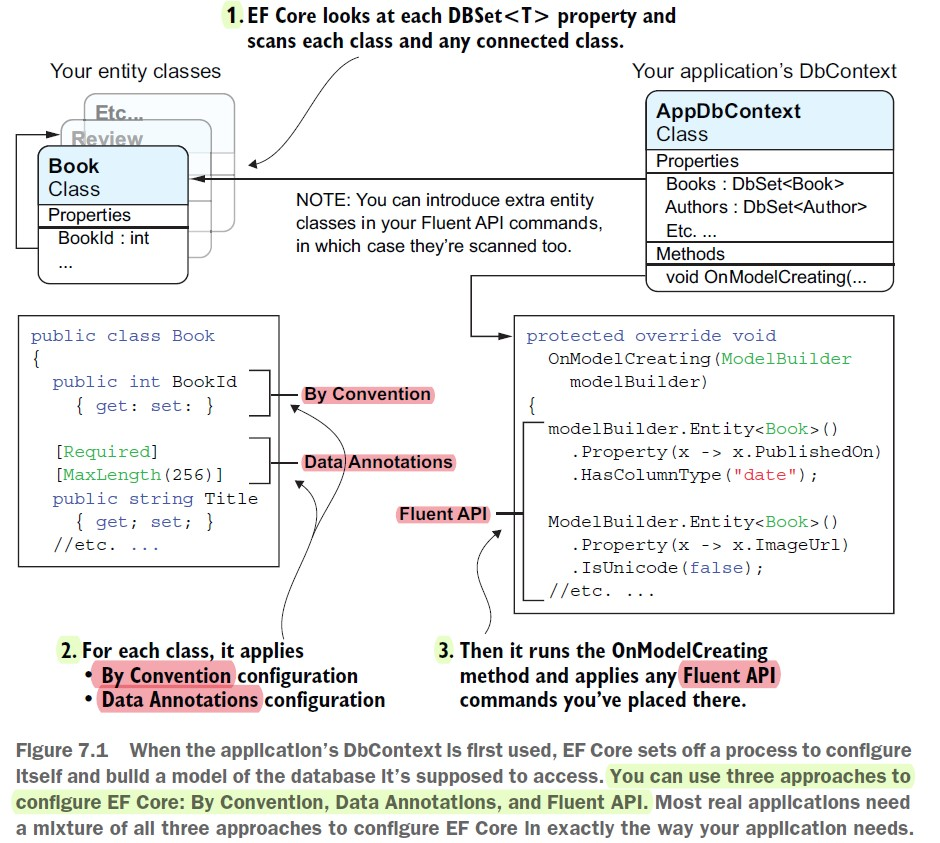
</p>

In summary, EF Core offers three configuration approaches:  
1. **By Convention**: Automatically configures features based on property types and names; simple but limited.  
2. **Data Annotations**: Adds .NET attributes to classes/properties for additional configuration and validation.  
3. **Fluent API**: Overrides `OnModelCreating` to define configurations using commands; the most comprehensive option, enabling features exclusive to this method.

<p align="center">
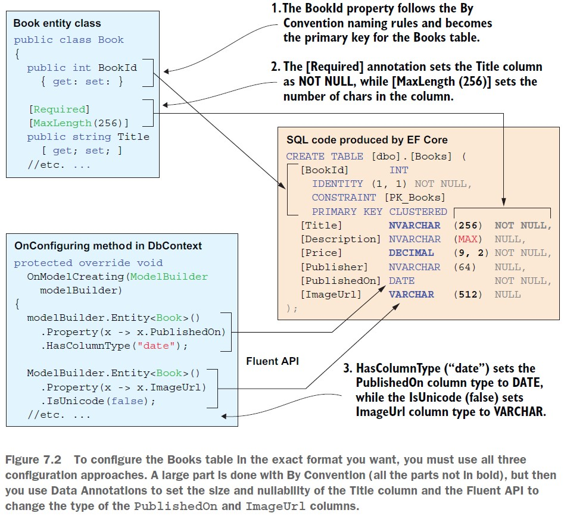
</p>


### EF Core conventions

The code follows these conventions:  
- A table's name matches the corresponding `DbSet<T>` property in `DbContext` (e.g., `Products`).  
- EF Core **expects one primary-key property**. The property is called `Id` or `<class name>id` (such as `ProductId`).If it's an integer or `Guid`, it is treated as an IDENTITY column (auto-generated values on insertion).
- Column names match the property names in the entity class (e.g., `Title`).  
- The .NET `string` type maps to `nvarchar` in the database. The .NET `int` type maps to `int` in the database.  

<p align="center">
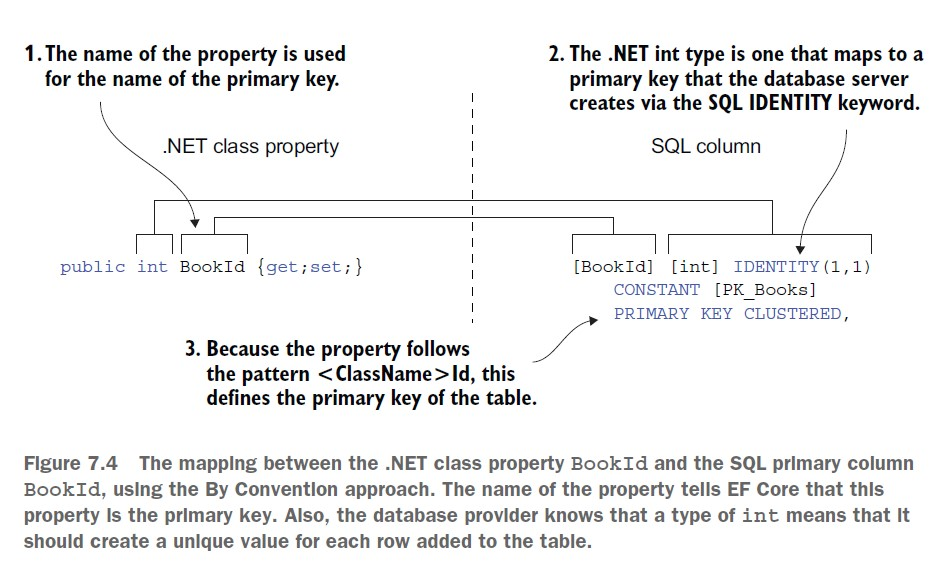
</p>


<p align="center">
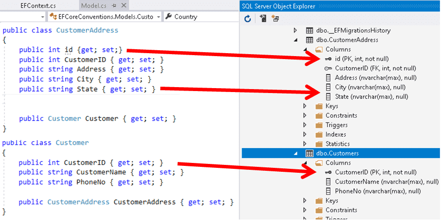
</p>

### EF Core annotation attributes

Conventions often aren't enough to completely map the classes to the database objects. **Data annotation attributes** are used to provide additional configuration and validation. They are placed on the entity class or its properties.

For example, in the database, the maximum length of a product name is 40, and the value cannot be null. In a Product class, we could apply attributes to specify this, as shown in the following code:


```csharp
[Required]
[StringLength(40)]
public string ProductName { get; set; }
```

In the Category table, the Description column can be longer than the 8,000 characters that can be stored in a `nvarchar` variable, so it needs to map to `ntext` instead, as shown in the following code:

```csharp
[Column(TypeName = "ntext")]
public string Description { get; set; }
```

<p align="center">
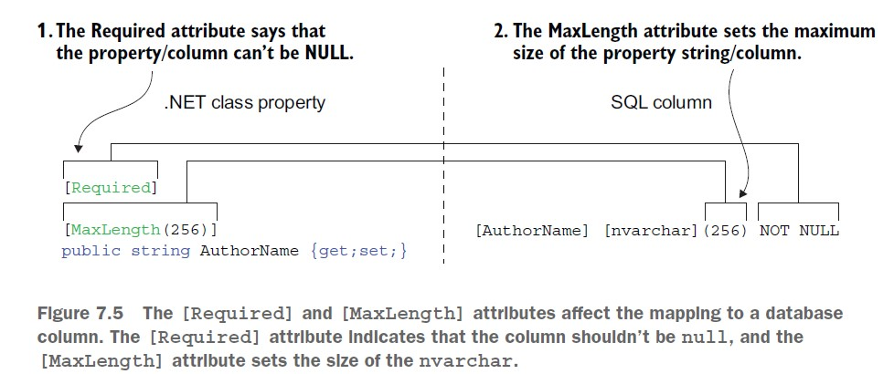
</p>

### EF Core Fluent API

The last way that the model can be defined is by using the Fluent API. This API can be used instead of attributes, as well as being used in addition to them. For example, let's look at the following two attributes in a Product class, as shown in the following code:

```csharp
[Required]
[StringLength(40)]
public string ProductName { get; set; }
```

The attributes could be removed from the class to keep it simpler, and replaced with
an equivalent Fluent API statement in the OnModelCreating method of a database
context class, as shown in the following code:

```csharp
modelBuilder.Entity<Product>()
.Property(product => product.ProductName)
.IsRequired()
.HasMaxLength(40);
```

### **Configuring nonrelational properties**

#### Setting database column type, size, and nullability

<p align="center">
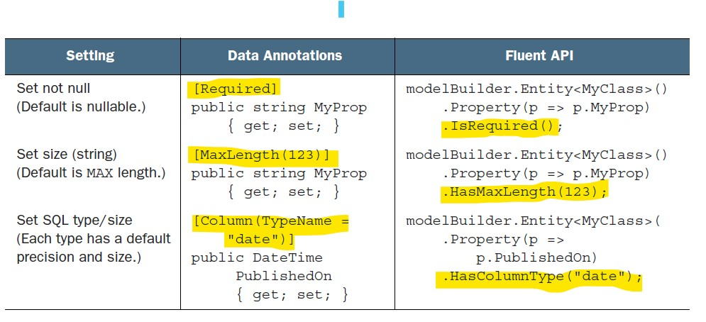
</p>


#### The different ways of configuring the primary key

You’ve already seen the By Convention approach of setting up the primary key of an entity : `<class name>Id` or `Id`.

But You need to configure the primary key explicitly in two situations:
- When the key name doesn’t fit the By Convention naming rules; not `Id` or `<class name>Id`
- When the primary key is made up of more than one property/column, called a **composite key**

##### Configuring a primary key via Data Annotations

The `[Key]` attribute allows you to designate one property as the primary key in a class. Use this annotation when you don’t use the By Convention primary key name, as shown in the following listing.

```csharp
private class SomeEntity
{
    [Key]
    public int NonStandardKeyName { get; set; }
}
```

##### Configuring a primary key via the Fluent API

You can also configure a primary key via the Fluent API’s `HasKey` method, which is useful for primary keys that don’t fit the By Convention patterns. 

```csharp
protected override void
OnModelCreating(ModelBuilder modelBuilder)
{
    // single primary key
    modelBuilder.Entity<SomeEntity>().HasKey(x => x.NonStandardKeyName);
    // composite primary key
    modelBuilder.Entity<BookAuthor>().HasKey(x => new {x.BookId, x.AuthorId});
}
```

#### Adding indexes to database columns

Relational databases have a feature called an index, which provides quicker searching and sorting of rows based on the column, or columns, in the index. In addition, an index may have a constraint, which ensures that each entry in the index is unique.

To add an index to a column, you can use the `Index` attribute, as shown in the following code:

```csharp
[Index]
public string ProductName { get; set; }
```

To add an index to a column with a unique constraint, you can use the `Index` attribute with the `IsUnique` property set to `true`, as shown in the following code:

```csharp
[Index(IsUnique = true)]
public string ProductName { get; set; }
```

To add an index to a column using the Fluent API, you can use the `HasIndex` method, as shown in the following code:

```csharp
protected override void OnModelCreating(ModelBuilder modelBuilder)
{
    modelBuilder.Entity<Product>()
        .HasIndex(p => p.ProductName);
    // multiple columns
    modelBuilder.Entity<Product>()
        .HasIndex(p => new { p.ProductName, p.ProductId });
}
```

#### Excluding properties and classes from the database

Sometimes, you might want to exclude a property or an entire class from the database. 

##### Excluding a class or property via Data Annotations

EF Core will exclude a property or a class that has a `[NotMapped]` data attribute applied to it.

```csharp
public class MyEntityClass
{
    public int MyEntityClassId { get; set; }
    public string NormalProp{ get; set; }
    [NotMapped]
    public string LocalString { get; set; }
    public ExcludeClass LocalClass { get; set; }
}
[NotMapped]
public class ExcludeClass
{
    public int LocalInt { get; set; }
}
```

##### Excluding a class or property via Fluent API

To exclude a property or class from the database using the Fluent API, you can use the `Ignore` method. The following code shows how to exclude a property from the database:

```csharp
protected override void OnModelCreating(ModelBuilder modelBuilder)
{
    modelBuilder.Entity<MyEntityClass>()
        .Ignore(e => e.LocalString);
}
```


### **Configuring relationships**

#### Defining some relationship terms

<p align="center">
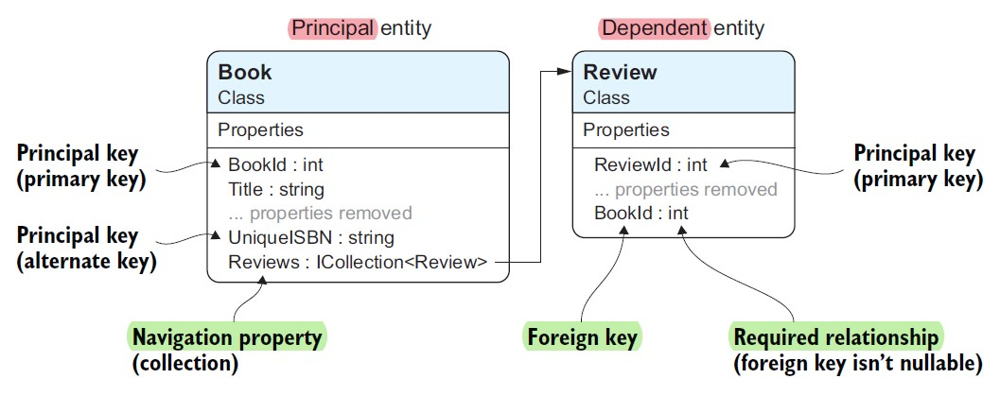
</p>

Here are concise descriptions of key EF Core terms:  
- **Principal Key**: A unique key in an entity, either a primary or alternate key.  
- **Principal Entity**: The entity containing the principal key that dependent entities reference via foreign keys.  
- **Dependent Entity**: The entity with foreign keys referencing a principal entity.  
- **Navigational Property**: A property linking entity classes, containing either a single entity or a collection.  
- **Foreign Key**: A property holding the value of a principal key (nullable in optional relationships).  
- **Required Relationship**: A relationship where the foreign key is non-nullable, requiring the principal entity.  
- **Optional Relationship**: A relationship with a nullable foreign key, allowing the principal entity to be absent.

##### What navigational properties do you need?

Configuring relationships should align with your project's business needs. While navigational properties can be added at both ends, not all are useful. Only include those that make sense from a business or design perspective.

For example, in a Book App:  
- A `Book` class with an `ICollection<Review>` navigational property is essential to calculate average review scores.  
- A `Review` class doesn't need a `Book` navigational property if the relationship isn't used in the app.  

This selective approach simplifies entity classes and prevents misuse by junior developers, focusing only on meaningful relationships.

#### Configuring relationships By Convention

The By Convention approach is a real time-saver when it comes to configuring relationships. EF Core automatically detects relationships based on property types and names, as shown in the following code:

<p align="center">
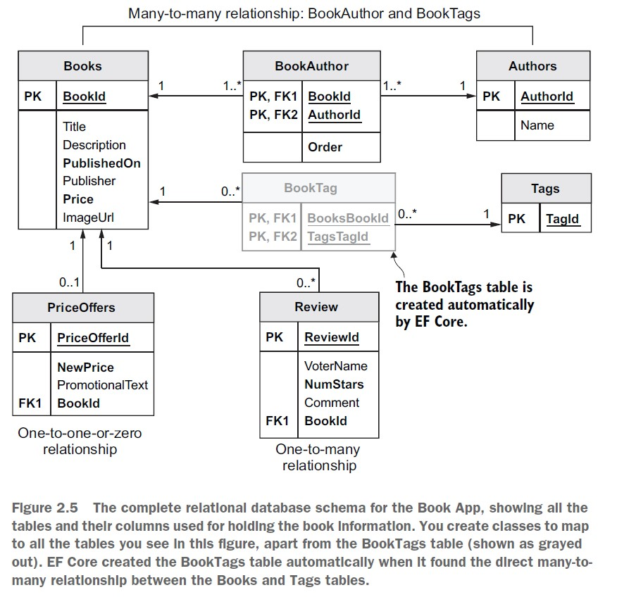
</p>


##### One-to-Many Relationship  

```csharp
public class Book
{
    public int BookId { get; set; }
    public required string Title { get; set; }
    public virtual ICollection<Review>? Reviews { get; set; } // 1-M Navigation property
}

public class Review
{
    public int ReviewId { get; set; }
    public required string ReviewText { get; set; }
    public int BookId { get; set; } // Foreign key
    public required Book Book { get; set; }  // Navigation property
}
```

<p align="center">
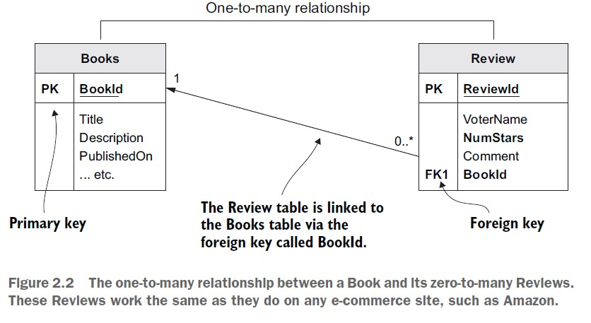
</p>

In this case, EF Core detects that `Book` has many `Reviews`, while each `Review` belongs to one `Book`.  

---

##### One-to-One Relationship  

```csharp
public class Book
{
    public int BookId { get; set; }
    public string Title { get; set; }
    public virtual PriceOffer? PriceOffer { get; set; } // 1-0/1 Navigation property
}

public class PriceOffer
{
    public int PriceOfferId { get; set; }
    public decimal NewPrice { get; set; }
    public int BookId { get; set; } // Foreign key
    public required Book Book { get; set; }  // Navigation property
}
```

<p align="center">

</p>

Here, each `Book` has one `PriceOffer`, and each `PriceOffer` belongs to one `Book`.  


##### Many-to-Many Relationship  

```csharp
public class Book
{
    public int BookId { get; set; }
    public required string Title { get; set; }
    public virtual ICollection<Review>? Reviews { get; set; } // 1-M Navigation property
    public virtual PriceOffer? PriceOffer { get; set; } // 1-0/1 Navigation property
    public virtual required ICollection<Author> Authors { get; set; } = new List<Author>(); // Navigation property
    public ICollection<Tag>? Tags { get; set; } = new List<Tag>(); // Navigation property
}

public class Author
{
    public int AuthorId { get; set; }
    public required string Name { get; set; }
    public ICollection<Book>? Books { get; set; } = new List<Book>(); // Navigation property
}

public class Tag
{
    public int TagId { get; set; }
    public required string Name { get; set; }
    public ICollection<Book>? Books { get; set; } = new List<Book>(); // Navigation property
}

```

For many-to-many relationships, EF Core automatically creates junction tables (`BookAuthors` and `BookTags`) to represent the links.  

<p align="center">
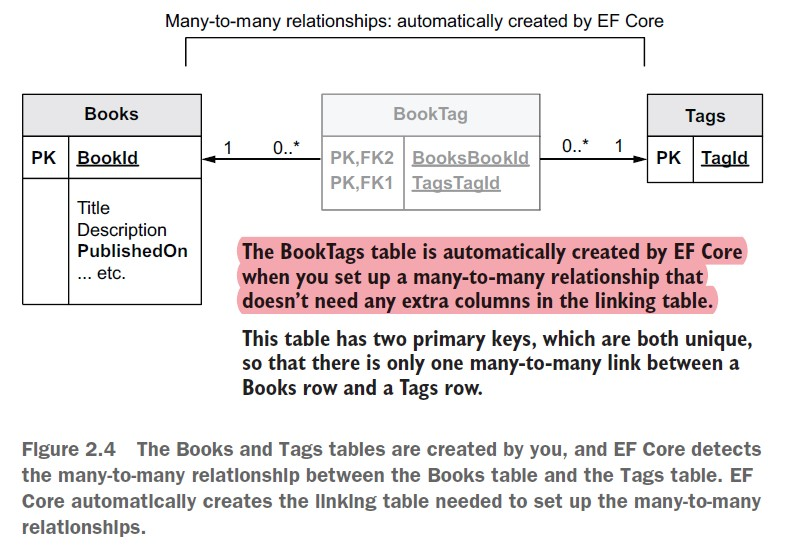
</p>

<p align="center">
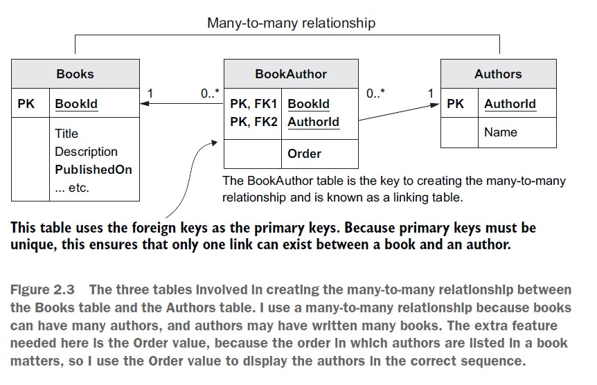
</p>


> Foreign keys: What happens if you leave them out?

If you don't include a foreign key property in the dependent entity, EF Core will create a shadow property for you. This property will be named `<navigation property name><principal key property name>`. For example, if you have a `Book` entity with a `Reviews` navigation property, and the primary key of the `Book` entity is `BookId`, EF Core will create a shadow property named `BookId` in the `Review` entity.

> When does By Convention configuration not work?

If you’re going to use the By Convention configuration approach, you need to know when it’s not going to work so that you can use other means to configure your relationship. Here’s my list of scenarios that won’t work, with the most common listed first:
- You have composite foreign keys
- You want to create a one-to-one relationship without navigational links going both ways 
- You want to override the default delete-behavior setting
- You have two navigational properties going to the same class
- You want to define a specific database constraint

#### Creating an instance of the application’s DbContext

```csharp
public class RepositoryContext : DbContext
{

    public RepositoryContext(DbContextOptions options) : base(options) { }
    protected override void OnConfiguring(DbContextOptionsBuilder optionsBuilder)
    {
        optionsBuilder.ConfigureWarnings(warnings => warnings.Ignore(RelationalEventId.PendingModelChangesWarning));
    }

    public DbSet<Book> Books { get; set; }
    public DbSet<Review> Reviews { get; set; }
    
    public DbSet<PriceOffer> PriceOffers { get; set; }
    public DbSet<Author> Authors { get; set; }
    public DbSet<Tag> Tags { get; set; }

}
```

<p align="center">
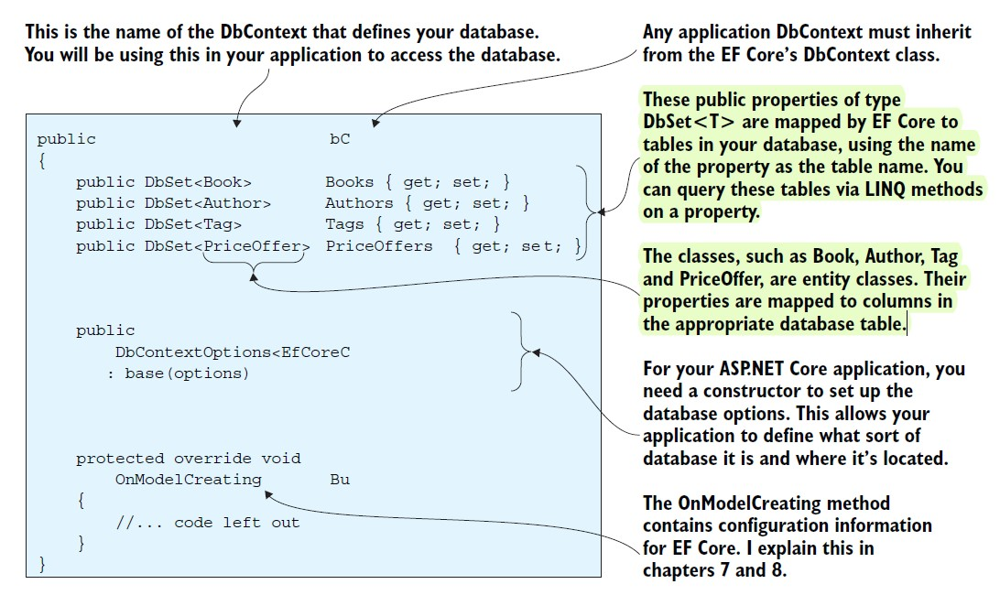
</p>

## CRUD

Example models:

`Models.cs`

```csharp
public class League
{
    public int Id { get; set; }
    public required string Name { get; set; }
    // One-to-many relationship: A League can have many Teams
    public virtual List<Team> Teams { get; set; } = new List<Team>();//or assign `null!` null-forgiving operator
}

public class Team
{
    public int Id { get; set; }
    public required string Name { get; set; }
    // Foreign key for the League
    public int LeagueId { get; set; }
    // Navigation property for the League (many-to-one)
    public virtual League League { get; set; } = null!;
    // Navigation property for the one-to-one relationship with Coach
    public virtual Coach? Coach { get; set; }
    // Navigation properties for matches
    public virtual List<Match> HomeMatches { get; set; } = new List<Match>();
    public virtual List<Match> AwayMatches { get; set; } = new List<Match>();
}

/* 

TeamA -> Match (HomeTeam, AwayTeam) <- TeamB

TeamA has many HomeMatches (1-M)
TeamB has many AwayMatches (1-M)
Teams has many Matches with other Teams (M-M)

Similar to :

Customer -> Order(CustomerId, ProductId) <- Product

Customer makes M Orders (1-M)
Product has M Orders (M-1)
Many products has many Cu
 */
public class Match
{
    public int Id { get; set; }
    public int HomeTeamId { get; set; }
    public virtual Team HomeTeam { get; set; } = null!;
    public int AwayTeamId { get; set; }
    public virtual Team AwayTeam { get; set; } = null!;
    public decimal TicketPrice { get; set; }
    public DateTime Date { get; set; }
}

/* 
This type of complex relationship must be handled with fluent API
> Without fluent API, migration will throw the following error >  The exception 'Unable to determine the relationship represented by navigation 'Match.AwayTeam' of type 'Team'.
 
Therefore see > TeamConfiguration class for the configuration of the relationship between Team and Match

Other relationships are following the convention and do not require fluent API
 */
public class Coach
{
    public int Id { get; set; }
    public required string Name { get; set; }
    // Nullable foreign key for the Team
    public int? TeamId { get; set; }
    // Navigation property for the one-to-one relationship with Team
    public virtual Team? Team { get; set; }
}

```

`TeamConfiguration.cs`

```csharp
public class TeamConfiguration : IEntityTypeConfiguration<Team>
{
    public void Configure(EntityTypeBuilder<Team> builder)
    {

        builder.HasMany(m => m.HomeMatches)
            .WithOne(m => m.HomeTeam)
            .HasForeignKey(m => m.HomeTeamId)
            .IsRequired()
            .OnDelete(DeleteBehavior.Restrict);

        builder.HasMany(m => m.AwayMatches)
            .WithOne(m => m.AwayTeam)
            .HasForeignKey(m => m.AwayTeamId)
            .IsRequired()
            .OnDelete(DeleteBehavior.Restrict);
    }
}
```


### CREATE

#### Non-Relational

##### creating single principal record

```csharp
    var league = new League
    {
        Name = "League 1",
        // Id = not required
    };
    await context.Leagues.AddAsync(league);
    await context.SaveChangesAsync();
```

##### creating principal record in bulks

```csharp
    var leagues = new List<League> {
        new League{Name = "League 2"},
        new League{Name = "League 3"},
    };

    await context.Leagues.AddRangeAsync(leagues);
    await context.SaveChangesAsync();
```

#### Relational

Creating with any dependent table without providing it's principal table reference will throw `'FOREIGN KEY constraint failed'` exception.

Relation with it's principal table must be established through foreign key or navigation property.


##### (1-m) Create dependent and connect it's principal by foreign key 

```csharp
var leagueParent = await context.Leagues.FirstOrDefaultAsync(l => l.Id == league1Id);
if (leagueParent != null)
{
    var teamChild = new Team
    {
        Name = "Team 1",
        LeagueId = leagueParent.Id
    };
    
    await context.Teams.AddAsync(teamChild);
    await context.SaveChangesAsync();
}
```

##### (1-m) Create dependent and connect it's principal by navigational property

```csharp
 var leagueParent = await context.Leagues.FindAsync(league1Id);
if (leagueParent != null)
{
    var teamChild = new Team
    {
        Name = "Team 2",
        League = leagueParent
    };
    
    await context.Teams.AddAsync(teamChild);
    await context.SaveChangesAsync();

}
```

##### (1-m) Create both dependent and principal and connect them by id 

```csharp
var league = new League { Name = "League 4" };

await context.Leagues.AddAsync(league);
await context.SaveChangesAsync();// must be called before adding team; otherwise, league.Id will be null
Console.WriteLine($"League Id: {league.Id}");

var team = new Team { Name = "Team 4", LeagueId = league.Id };

await context.Teams.AddAsync(team);
await context.SaveChangesAsync();
```

##### (1-m) Create both dependent and principal and connect them by navigational Property

```csharp
var league = new League { Name = "League 4" };
var team = new Team { Name = "Team 4", League = league };

await context.Teams.AddAsync(team);
await context.SaveChangesAsync();

/* 
    No need to add league to context
    ⛔await context.Leagues.AddAsync(league);
    ⛔await context.SaveChangesAsync();
    
    SaveChanges will automatically add league to context
    */
```

##### (m-1) Create principal and along with it's dependents

```csharp
    var teams = new List<Team>
    {
        new Team { Name = "Team 5" },
        new Team { Name = "Team 6" }
    };

    var league = new League { Name = "League 5", Teams = teams };
    await context.Leagues.AddAsync(league);
    await context.SaveChangesAsync();
```

##### 1-1/0 relation

```csharp
//    1-1
   var coach1 = new Coach { Name = "Jose Mourinho", TeamId = 3 };
   await context.AddAsync(coach1);
//    1-0
   var coach2 = new Coach { Name = "Antonio Conte" };
   
   await context.AddAsync(coach2);
   await context.SaveChangesAsync();
```


##### Many-to-Many

```csharp
    var teamA = await context.Teams.FirstOrDefaultAsync(t => t.Id == id1);
    var teamB = await context.Teams.FirstOrDefaultAsync(t => t.Id == id2);

    if (teamA != null && teamB != null)
    {
        var match2 = new Match
        {
            HomeTeam = teamA,
            AwayTeam = teamB,
            TicketPrice = 200,
            Date = DateTime.Now
        };
        await context.Matches.AddAsync(match2);
        await context.SaveChangesAsync();
    }
```

### READ 

#### Non-Relational


##### Get all records

```csharp
async Task<List<League>> getMany()
{
    return await context.Leagues.ToListAsync();
}
```

##### Get single records

```csharp
    //    v1
    var league1 = await context.Leagues.FindAsync(id);
    Console.WriteLine($"League 1: {league1.Name}");//nullable 
    //    v2
    var league2 = await context.Leagues.FirstOrDefaultAsync(l => l.Id == id);
    Console.WriteLine($"League 2: {league2.Name}");//nullable
    // v3
    var league3 = await context.Leagues.Where(l => l.Id == id).SingleAsync();
    Console.WriteLine($"League 3: {league3.Name}");//not nullable; throws exception if not found
    // v4
    var league4 = await context.Leagues.SingleAsync(l => l.Id == id);
    Console.WriteLine($"League 4: {league4.Name}");//not nullable; throws exception if not found
```

##### Get records with including it's Parent record

```csharp
async Task<List<Team>> includeParentRelated()
{
    return await context.Teams.Include(t => t.League).ToListAsync();
}

foreach (var team in teams){
    Console.WriteLine($"Team: {team.Name}, League: {team.League.Name}");
}
```

##### Get a record with including it's Child records

```csharp
async Task<League> includeChildRelated(int parentId)
{
    return await context.Leagues.Where(l => l.Id == parentId).Include(l => l.Teams).SingleAsync();
}

var league = await includeChildRelated(league1Id);
Console.WriteLine($"League: {league.Name}");
foreach (var team in league11.Teams)
{
    Console.WriteLine($"Team: {team.Name}");
    break;
}
```

##### Select many-to-many 

```csharp
async Task<List<Match>> includeManyToMany()
{
    return await context.Matches.Include(m => m.HomeTeam).Include(m => m.AwayTeam).ToListAsync();
}
var matches = await includeManyToMany();
foreach (var match in matches)
{
    Console.WriteLine($"Match: {match.HomeTeam.Name} vs {match.AwayTeam.Name}");
    // break;
}
```