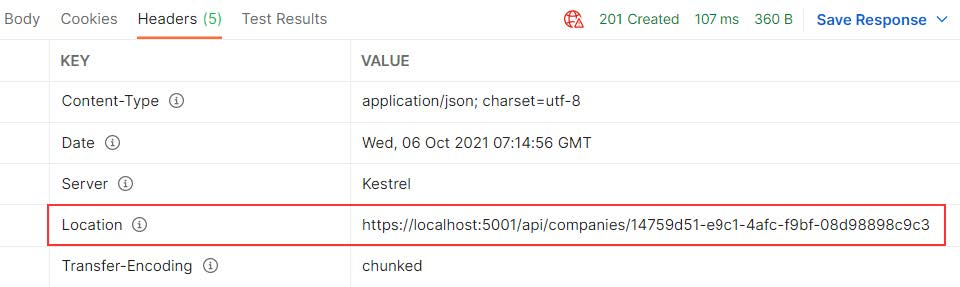

# ASP.NET CORE mvc webpi | Onion architecture

- [ASP.NET CORE mvc webpi | Onion architecture](#aspnet-core-mvc-webpi--onion-architecture)
  - [Simplified Repository Pattern Logic](#simplified-repository-pattern-logic)
    - [Repository User Interfaces and Classes](#repository-user-interfaces-and-classes)
    - [Creating a Repository Manager](#creating-a-repository-manager)
  - [Registering RepositoryContext at a Runtime](#registering-repositorycontext-at-a-runtime)
  - [Adding a Service Layer](#adding-a-service-layer)
  - [Controllers and Routing in WEB API](#controllers-and-routing-in-web-api)
    - [Routing..](#routing)
  - [GET: All - implementing business logic](#get-all---implementing-business-logic)
      - [Getting All Companies From the Database](#getting-all-companies-from-the-database)
  - [DTO Classes vs. Entity Model Classes](#dto-classes-vs-entity-model-classes)
  - [Using `AutoMapper` in ASP.NET Core](#using-automapper-in-aspnet-core)
  - [Global Error Handling](#global-error-handling)
  - [GET: a Single Resource](#get-a-single-resource)
    - [Handling Invalid Requests in a Service Layer](#handling-invalid-requests-in-a-service-layer)
  - [GET: Parent/Child Relationships in Web API](#get-parentchild-relationships-in-web-api)
    - [Getting a Single Employee for Company](#getting-a-single-employee-for-company)
  - [POST: creating Resources](#post-creating-resources)
    - [Creating a Child Resource](#creating-a-child-resource)
    - [Creating Children Resources Together with a Parent](#creating-children-resources-together-with-a-parent)
    - [Creating a Collection of Resources](#creating-a-collection-of-resources)
    - [Model Binding in API](#model-binding-in-api)
  - [DELETE: Requests](#delete-requests)
    - [Deleting a Parent Resource with its Children](#deleting-a-parent-resource-with-its-children)
  - [PUT Requests](#put-requests)
    - [Updating a Child Resource](#updating-a-child-resource)
      - [About Using `Save()` instead of `Update` Method from the RepositoryBase](#about-using-save-instead-of-update-method-from-the-repositorybase)
    - [Inserting Child Resources while Updating a Parent Resource](#inserting-child-resources-while-updating-a-parent-resource)


## Simplified Repository Pattern Logic

The **Repository Pattern** involves creating a **generic repository** to handle basic CRUD operations. This allows you to reuse these methods across different repository classes in your project. 

Here’s the flow:

1. **Generic Repository**: Contains reusable CRUD methods applicable to all data types.
2. **Specific Repository Classes**: Extend the generic repository to handle entity-specific logic.
3. **Service Wrapper**: A wrapper class integrates all repository classes, enabling centralized access.
4. **Dependency Injection**: The service wrapper is registered in the **DI container**, allowing controllers to access any repository through a single, reusable service instance. 

This setup ensures clean code, scalability, and centralized control over data operations.

- create a new Class Library (C#) project named `Contracts`, we are going to keep our interfaces.
- Add a reference to the `Contracts` project in the `Repository` project. 
  - Note, Since `Contracts` is referenced in `Repository`, **there's no need to add it separately in the `API`** project for dependency injection (`services.AddScoped<IRepositoryManager, RepositoryManager>();`) because the `Repository` project is already referenced in `API` and `Contracts` project in the `Repository`.
- Now, create an interface for the repository inside the Contracts project:

`Contracts\IRepositoryBase.cs`

```csharp
using System.Linq.Expressions;
namespace Contracts;
public interface IRepositoryBase<T>
{
    IQueryable<T> FindAll(bool trackChanges);
    IQueryable<T> FindByCondition(Expression<Func<T, bool>> expression,
    bool trackChanges);
    void Create(T entity);
    void Update(T entity);
    void Delete(T entity);
}
```

Right after the interface creation, in the `Repository` project, we are going to create an abstract class `RepositoryBase` — which is going to implement the `IRepositoryBase` interface:


```csharp
using System;
using System.Linq.Expressions;
using Contracts;
using Microsoft.EntityFrameworkCore;

namespace Repository;

public abstract class RepositoryBase<T> : IRepositoryBase<T> where T : class
{
    protected RepositoryContext RepositoryContext;
    public RepositoryBase(RepositoryContext repositoryContext) => RepositoryContext = repositoryContext;

    public IQueryable<T> FindAll(bool trackChanges) =>
        !trackChanges ?
            RepositoryContext.Set<T>()
                .AsNoTracking() :
            RepositoryContext.Set<T>();

    public IQueryable<T> FindByCondition(Expression<Func<T, bool>> expression, bool trackChanges) =>
        !trackChanges ?
            RepositoryContext.Set<T>()
                .Where(expression)
                .AsNoTracking() :
            RepositoryContext.Set<T>()
                .Where(expression);

    public void Create(T entity) => RepositoryContext.Set<T>().Add(entity);
    public void Update(T entity) => RepositoryContext.Set<T>().Update(entity);
    public void Delete(T entity) => RepositoryContext.Set<T>().Remove(entity);
}
```

Generic type `T`. This type T gives even more reusability to the RepositoryBase class as we don’t have to specify the exact model (class) right now for the RepositoryBase to work with.

Moreover, we can see the `trackChanges` parameter. We are going to use it to improve our read-only query performance. When it’s set to false, we attach the AsNoTracking method to our query to inform EF Core that it
doesn’t need to track changes for the required entities. This greatly improves the speed of a query.

### Repository User Interfaces and Classes

Now that we have the `RepositoryBase` class, let’s create the user classes that will inherit this abstract class.
By inheriting from the `RepositoryBase` class, they will have access to all the methods from it.

**Furthermore**, every user class will have its interface for additional model-specific methods. Let’s create the interfaces in the `Contracts` project for the `Company` and `Employee` classes:

`Contracts\IEmployeeRepository.cs`

```csharp
namespace Contracts;
public interface IEmployeeRepository{}
```

`Contracts\ICompanyRepository.cs`

```csharp
namespace Contracts;
public interface ICompanyRepository{}
```


After this, we can create**repository user classes** in the `Repository` project - (`CompanyRepository`, `EmployeeRepository`)

`Repository\CompanyRepository.cs`:

```csharp
using Contracts;
using Entities.Models;
namespace Repository;
public class CompanyRepository : RepositoryBase<Company>, ICompanyRepository
{
    public CompanyRepository(RepositoryContext repositoryContext) : base(repositoryContext) { }
}
```

`Repository\EmployeeRepository.cs`:


```csharp
using Contracts;
using Entities.Models;
namespace Repository;
public class EmployeeRepository : RepositoryBase<Employee>, IEmployeeRepository
{
    public EmployeeRepository(RepositoryContext repositoryContext) : base(repositoryContext) { }
}
```

After these steps, we are finished creating the repository and repository user classes. 
> But there are still more things to do.

### Creating a Repository Manager

APIs often return data from multiple resources, such as all companies and employees over 30. Managing this with multiple repository classes can become complex, what if we need the combined logic of five or even more different classes?


To simplify, we'll create a **repository manager class** that **instantiates repository user classes** and **registers them in the dependency injection container**.

But we are also missing one important part. We have the `Create`, `Update`, and `Delete` methods in the `RepositoryBase` class, but they won’t make any change in the database until we call the `SaveChanges` method. Our repository manager class will handle that as well.

That said, let’s get to it and create a new interface in the `Contract` project:

`Contracts\IRepositoryManager.cs`

```csharp
namespace Contracts;

public interface IRepositoryManager
{
    ICompanyRepository Company { get; }
    IEmployeeRepository Employee { get; }
    void Save();
}
```

And add a new class to the `Repository` project:

```csharp
using Contracts;
namespace Repository;
public sealed class RepositoryManager : IRepositoryManager
{
    private readonly RepositoryContext _repositoryContext;
    private readonly Lazy<ICompanyRepository> _companyRepository;
    private readonly Lazy<IEmployeeRepository> _employeeRepository;
    public RepositoryManager(RepositoryContext repositoryContext)
    {
        _repositoryContext = repositoryContext;
        _companyRepository = new Lazy<ICompanyRepository>(() => new CompanyRepository(repositoryContext));
        _employeeRepository = new Lazy<IEmployeeRepository>(() => new EmployeeRepository(repositoryContext));
    }
    public ICompanyRepository Company => _companyRepository.Value;
    public IEmployeeRepository Employee => _employeeRepository.Value;
    public void Save() => _repositoryContext.SaveChanges();
}
```

Notice that the repository manager exposes concrete repositories as properties and provides a single `Save()` method for persisting all changes. This approach enables batching multiple operations, such as adding two companies, updating two employees, and deleting one company, into a single transaction. If something fails, all changes are reverted. Example:

```csharp
_repository.Company.Create(company);
_repository.Company.Create(anotherCompany);
_repository.Employee.Update(employee);
_repository.Employee.Update(anotherEmployee);
_repository.Company.Delete(oldCompany);
_repository.Save();
```

Also, The **RepositoryManager** utilizes the `Lazy` class for lazy initialization of repositories. This ensures repository instances are created only when accessed for the first time, optimizing resource usage and improving performance.


To integrate the **RepositoryManager**, register it in the main project by updating the `ServiceExtensions` and `Program` classes:

1. **Modify `ServiceExtensions`**:
   ```csharp
   public static void ConfigureRepositoryManager(this IServiceCollection services) =>
       services.AddScoped<IRepositoryManager, RepositoryManager>();
   ```

2. **Update `Program` Class**:
   Add the following line above the `AddControllers()` method:
   ```csharp
   builder.Services.ConfigureRepositoryManager();
   ``` 

This ensures the `RepositoryManager` is available as a scoped service throughout the application.

Excellent - The repository layer is prepared and ready to be used to fetch data from the database.


## Registering RepositoryContext at a Runtime

With the `RepositoryContextFactory` class, which implements the `IDesignTimeDbContextFactory` interface, we have registered our RepositoryContext class at **design time**. **This helps us find the RepositoryContext class in another project while executing migrations.**

But, as you could see, we have the `RepositoryManager` service registration, which happens at runtime, and during that registration, w**e must have `RepositoryContext` registered as well in the runtime**, so we could inject it into other services

Let’s modify the `ServiceExtensions` class

```csharp
    public static void ConfigureSqlContext(this IServiceCollection services, IConfiguration configuration)
    {
        services.AddDbContext<RepositoryContext>(opts =>
        {

            var database = configuration.GetConnectionString("Database");
            if (database == "sqlite")
            {
                opts.UseSqlite(configuration.GetConnectionString("DefaultConnection"));

            }
            /* 
            cd root
            dotnet ef migrations add firstMigration --project Repository --startup-project API
            dotnet ef migrations add firstMigration -p Repository -s API
            dotnet ef database update -p Repository -s API
             */
        }
        );
    }
```

As the final step, we have to call this method in the `Program` class:

```csharp
builder.Services.ConfigureSqlContext(builder.Configuration);
```


## Adding a Service Layer

The Service layer sits right above the Domain layer (the Contracts project is the part of the Domain layer), which means that it has a reference to the Domain layer. The Service layer will be split into two projects, `Service.Contracts` and `Service`.


Create `Service.Contracts` project (.NET Class Library) where we will hold the definitions for the service interfaces that are going to encapsulate the main business logic

Once the project is created, we are going to add three interfaces inside it.

`Service.Contracts\ICompanyService.cs`:

```csharp
namespace Service.Contracts;
public interface ICompanyService{}
```

`Service.Contracts\IEmployeeService.cs`:

```csharp
namespace Service.Contracts;
public interface IEmployeeService{}
```

`Service.Contracts\IServiceManager.cs`

```csharp
namespace Service.Contracts;
public interface IServiceManager
{
    ICompanyService CompanyService { get; }
    IEmployeeService EmployeeService { get; }
}
```


Now, we can create another project, name it `Service`, and reference the `Service.Contracts` and `Contracts` projects inside it:

`Service\Service.csproj`


```jsx
<ItemGroup>
    <ProjectReference Include="..\Contracts\Contracts.csproj" />
    <ProjectReference Include="..\Service.Contracts\Service.Contracts.csproj" />
</ItemGroup>
```

After that, we are going to create classes that will inherit from the interfaces that reside in the `Service.Contracts` project. So, let’s start with the `CompanyService` class:

`Service\CompanyService.cs`
```csharp
using Contracts;
using Service.Contracts;
namespace Service;
internal sealed class CompanyService : ICompanyService
{
    private readonly IRepositoryManager _repository;
    private readonly ILoggerManager _logger;
    public CompanyService(IRepositoryManager repository, ILoggerManager logger)
    {
        _repository = repository;
        _logger = logger;
    }
}

```

To continue, let’s create a new `EmployeeService` class:

`Service\EmployeeService.cs`

```csharp
using Contracts;
using Service.Contracts;
namespace Service;
internal sealed class EmployeeService : IEmployeeService
{
    private readonly IRepositoryManager _repository;
    private readonly ILoggerManager _logger;
    public EmployeeService(IRepositoryManager repository, ILoggerManager
    logger)
    {
        _repository = repository;
        _logger = logger;
    }
}
```


We are going to use `IRepositoryManager` to access the repository methods from each user repository class (`CompanyRepository` or
`EmployeeRepository`), and `ILoggerManager` to access the logging methods we’ve created in the second section of this book.


Finally, we are going to create the `ServiceManager` class:
`Service\ServiceManager.cs`:

```csharp
using Contracts;
using Service.Contracts;
namespace Service;
public sealed class ServiceManager : IServiceManager
{
    private readonly Lazy<ICompanyService> _companyService;
    private readonly Lazy<IEmployeeService> _employeeService;
    public ServiceManager(IRepositoryManager repositoryManager, ILoggerManager logger)
    {
        _companyService = new Lazy<ICompanyService>(() => new CompanyService(repositoryManager, logger));
        _employeeService = new Lazy<IEmployeeService>(() => new EmployeeService(repositoryManager, logger));
    }
    public ICompanyService CompanyService => _companyService.Value;
    public IEmployeeService EmployeeService => _employeeService.Value;
}
```

Now, with all these in place, we have to add the reference from the `Service` project inside the main project - `API` . Since Service is already referencing `Service.Contracts`, our main project will have the same reference as well.

Now, we have to modify the `ServiceExtensions` class:

```csharp
public static void ConfigureServiceManager(this IServiceCollection services) =>
services.AddScoped<IServiceManager, ServiceManager>();
```

Then, all we have to do is to modify the `Program` class to call this extension method:

```csharp
//..
builder.Services.ConfigureRepositoryManager();
builder.Services.ConfigureServiceManager();
//..
```

## Controllers and Routing in WEB API

Another separate project for Controller logic also?

This will improve design by isolating the **presentation layer**, which serves as the entry point for system interaction (e.g., REST APIs). This separation enforces stricter rules, preventing controllers from injecting anything they want and avoiding tight coupling with other projects; our presentation layer will depend only on the `service.contracts`, thus imposing more strict rules on our controllers.

- Create new class lib project - `Presentation`

- Inside `Presentation.csproj` file, we are going to add a new framework reference so it has access to the `ControllerBase` class for our future controllers:

`Presentation\Presentation.csproj`
```jsx
  <ItemGroup>
    <FrameworkReference Include="Microsoft.AspNetCore.App" />
  </ItemGroup>
```

- Additionally, let’s create a single class inside the Presentation project:

```csharp
namespace Presentation;
public static class AssemblyReference { }
```

It's an empty static class that we are going to use for the assembly reference inside the main project.

- Add reference of `Service.Contracts` project inside the `Presentation` project.
- Next, add reference of `Presentation` project inside the main project - `API`. 
  - As you can see, our presentation layer depends only on the service contracts, thus imposing more strict rules on our controllers.
- Now, we are going to delete the `Controllers` folder and the `WeatherForecast.cs` file from the main project because we are not going to need them anymore.

- Then, we have to modify the `Program.cs` file:

```csharp
builder.Services.AddControllers()
                .AddApplicationPart(typeof(Presentation.AssemblyReference).Assembly);
```


- let’s navigate to the `Presentation` project, create a new folder named `Controllers`, and
then a new class named `TestController.cs`.

`PPresentation\Controllers\TestController.cs`

```csharp
namespace Presentation.Controllers;
[Route("api/test")]
[ApiController]
public class TestController : ControllerBase{
    [HttpGet]
    public Person GetPerson()    {
        var person1 = new Person("John Doe", 30);
        return person1;
    }
}
public record Person(string Name, int Age);
```

### Routing..

There are two ways to implement routing in the project:

- Convention-based routing and
- Attribute routing

**Convention-based routing** maps URL paths using a predefined structure:  
- **First part**: Maps to the controller name.  
- **Second part**: Maps to the action method.  
- **Third part**: Represents an optional parameter.  

This can be configured in the **Program** class.

```csharp
app.MapContr011erRoute(
    name:"default",
    pattern: "{controller=Home}/{action=Index}/{id?}");
```
- URL: `api/products/5`  
  Maps to `ProductsController.Get(int id)`.

**Attribute Routing**  uses the attribute `[Route]` to map the routes directly to the action methods inside the controller. Usually

The ASP.NET Core team recommends using Attribute Routing over Convention-based Routing for Web API projects.

Example:
```csharp
[Route("api/products")]
public class ProductsController : ApiController
{
    [Route("")] // Matches "api/products"
    public IEnumerable<string> GetAll() => new[] { "Product1", "Product2" };

    [Route("{id:int}")] // Matches "api/products/5"
    public string GetById(int id) => $"Product {id}";
}
```

Different actions can use the same URI with different HTTP methods, such as `GET`, `POST`, or `DELETE` on `/api/companies`. Similarly, the same HTTP method can use different URIs for different actions—for example, `GET /api/companies` retrieves all companies, while `GET /api/companies/{companyId}` retrieves a specific company.

Naming Our Resources

The resource name in a URI should always be a **noun**, not an action. For example, use `/api/companies` to get all companies, not `/api/getCompanies`. The noun in the URI represents the resource, helping consumers understand its type—e.g., use "companies" for a companies resource, not "products" or "orders."

For hierarchical resources, follow this convention:  
`/api/principalResource/{principalId}/dependentResource`.  
For instance, since employees depend on a company, the route for employees should be:  
`/api/companies/{companyId}/employees`.

With this structure, you can proceed to define your `GET` requests.

## GET: All - implementing business logic

#### Getting All Companies From the Database

- add new class named `CompaniesController`
- change the base route from `[Route("api/[controller]")]` to `[Route("api/companies")]`

1. Now it is time to create the first action method to return all the companies from the database. Let’s create a definition for the `GetAllCompanies` method in the `ICompanyRepository` interface:
   1. For this to work, we need to add the `Entities` project reference inside the `Contracts` project


`Contracts\ICompanyRepository.cs`:
```csharp
using Entities.Models;
namespace Contracts;

public interface ICompanyRepository{
    IEnumerable<Company> GetAllCompanies(bool trackChanges);
}
```


2. Now, we can continue with the interface implementation in the `CompanyRepository` class:

`Repository\CompanyRepository.cs`:
```csharp
using Contracts;
using Entities.Models;
namespace Repository;
public class CompanyRepository : RepositoryBase<Company>, ICompanyRepository{
    public CompanyRepository(RepositoryContext repositoryContext) : base(repositoryContext) { }

    public IEnumerable<Company> GetAllCompanies(bool trackChanges) =>
                FindAll(trackChanges).OrderBy(c => c.Name).ToList();
}
```

As you can see, we are calling the `FindAll` method from the `RepositoryBase` class, ordering the result with the `OrderBy` method, and then executing the query with the `ToList` method.

3. After the repository implementation, we have to implement a service layer. Let’s start with the `ICompanyService` interface modification:
   1. Since the Company model resides in the `Entities` project, we have to add the Entities reference inside the `Service.Contracts` project.

`Service.Contracts\ICompanyService.cs`
```csharp
using Entities.Models;
namespace Service.Contracts;
public interface ICompanyService{
    IEnumerable<Company> GetAllCompanies(bool trackChanges);
}
```

4. Then, let’s continue with the `CompanyService` modification:

```csharp
using Contracts;
using Service.Contracts;
using Entities.Models;
namespace Service;
internal sealed class CompanyService : ICompanyService
{
    private readonly IRepositoryManager _repository;
    private readonly ILoggerManager _logger;
    public CompanyService(IRepositoryManager repository, ILoggerManager logger) {
        _repository = repository;
        _logger = logger;
    }

    public IEnumerable<Company> GetAllCompanies(bool trackChanges){
        try{
            var companies = _repository.Company.GetAllCompanies(trackChanges);
            return companies;
        }
        catch (Exception ex){
            _logger.LogError($"Something went wrong in the {nameof(GetAllCompanies)} service method {ex} ");
            throw;
        }
    }
}
```

5. Finally, we have to return companies by using the `GetAllCompanies` method inside the Web API controller.

```csharp
using Service.Contracts;
namespace Presentation.Controllers
{
    [Route("api/companies")]
    [ApiController]
    public class CompaniesController : ControllerBase {

        private readonly IServiceManager _service;
        public CompaniesController(IServiceManager service) => _service = service;
        
        [HttpGet]
        public ActionResult<IEnumerable<Company>> GetCompanies() {
            try{
                var companies = _service.CompanyService.GetAllCompanies(trackChanges: false);
                return Ok(companies);
            }
            catch{
                return StatusCode(500, "Internal server error");
            }
        }
    }
}
```

The `ActionResult` supports using a variety of methods, which return not only the result but also the status codes. In this situation, the `OK` method returns all the companies and also the status code `200` — which stands for `OK`. If an exception occurs, we are going to return the internal server error with the status code `500`. Because there is no route attribute right above the action, the route for the `GetCompanies` action will be `api/companies` which is the route placed on top of our controller.

## DTO Classes vs. Entity Model Classes

A data transfer object (**DTO**) is an object that we use to transport data between the client and server applications. It simplifies API responses, decouples them from database models, and preserves consistency even if models change, ensuring more maintainable code.

- create a new project named `Shared` and then a new folder `DTO` with the `CompanyDto` record inside:

```csharp
namespace Shared.DTO;
public record CompanyDto(Guid Id, string Name, string FullAddress);
```

**Records** are a good alternative to classes for DTOs because they are immutable by default and ideal for transferring data. 

In our `DTO`, we have **removed** the `Employees` property and we are going to use the `FullAddress` property to concatenate the `Address` and `Country` properties from the `Company` class. Furthermore, we are not
using validation attributes in this record, because we are going to use this record only to return a response to the client.

Now,
- **Add a reference** from the `Shared` project to the `Service.Contracts` project.  
- **Remove the `Entities` reference** from `Service.Contracts`. Now, the `Service.Contracts` project should only reference the `Shared` project.
- Then, we have to modify the `ICompanyService` interface:

`Service.Contracts\ICompanyService.cs`:
```csharp
using Shared.DTO;
namespace Service.Contracts;
public interface ICompanyService{
    IEnumerable<CompanyDto> GetAllCompanies(bool trackChanges);
}
```

- And modify the `CompanyService` class:

```csharp
using Contracts;
using Service.Contracts;
using Shared.DTO;
namespace Service;
internal sealed class CompanyService : ICompanyService{
    //....
    public IEnumerable<CompanyDto> GetAllCompanies(bool trackChanges){
            //..
            var companies = _repository.Company.GetAllCompanies(trackChanges);
            var companiesDto = companies.Select(c => new CompanyDto(c.Id, c.Name ?? "", 
                                                string.Join("", c.Address, c.Country))).ToList();
            return companiesDto;
            //...
    }
}
```

- Finally, change `Company` to `CompanyDto` in controller:

```csharp
public ActionResult<IEnumerable<CompanyDto>> GetCompanies(){
//..
    var companies = _service.CompanyService.GetAllCompanies(trackChanges: false);
    return Ok(companies);
//..
}
```

## Using `AutoMapper` in ASP.NET Core

AutoMapper is a library that helps us with mapping objects in our applications. By using this library, we are going to remove the code for manual mapping — thus making the action readable and maintainable.

- install AutoMapper - `AutoMapper`, choose the `Service` project
- create a profile class, also in the main project, where we specify the source and destination objects for mapping:

```csharp
using AutoMapper;
using Entities.Models;
using Shared.DTO;

namespace API;

public class MappingProfile : Profile
{
    public MappingProfile()
    {
        CreateMap<Company, CompanyDto>()
        .ForCtorParam("FullAddress", opt => opt.MapFrom(x => $"{x.Address} {x.Country}"));
    }
}     
```

In the constructor, we are using the `CreateMap` method where we specify the source object and the destination object to map to.Because we have the `FullAddress` property in our DTO record, which contains both the `Address` and the `Country` from the model class, we have to
specify additional mapping rules with the `ForCtorParam` method.


- After installation, we are going to register this library in the `Program` class:

```csharp
builder.Services.AddAutoMapper(typeof(MappingProfile));
```

Now, we have to modify the `ServiceManager` class to enable DI in our service classes:

```csharp
public sealed class ServiceManager : IServiceManager{
    //...
    public ServiceManager(IRepositoryManager repositoryManager, ILoggerManager logger, IMapper mapper)
    {
        _companyService = new Lazy<ICompanyService>(() => new CompanyService(repositoryManager, logger, mapper));
        _employeeService = new Lazy<IEmployeeService>(() => new EmployeeService(repositoryManager, logger, mapper));
    }
    //...
}
```

Of course, now we have two errors regarding our service constructors. So we need to fix that in both `CompanyService` and `EmployeeService`
classes:

```csharp
internal sealed class CompanyService : ICompanyService{
    //..
    public CompanyService(IRepositoryManager repository, ILoggerManager logger, IMapper mapper){
        _mapper = mapper;
        _repository = repository;
        _logger = logger;
    }
}
```

Finally, we can modify the `GetAllCompanies` method in the `CompanyService` class:

```csharp
internal sealed class CompanyService : ICompanyService{
    //..
    public CompanyService(IRepositoryManager repository, ILoggerManager logger, IMapper mapper){
        _mapper = mapper;
        _repository = repository;
        _logger = logger;
    }
    //...
    public IEnumerable<CompanyDto> GetAllCompanies(bool trackChanges){
        try{
            var companies = _repository.Company.GetAllCompanies(trackChanges);
            // var companiesDto = companies.Select(c => new CompanyDto(c.Id, c.Name ?? "",
            //                                     string.Join("", c.Address, c.Country))).ToList();
            var companiesDto = _mapper.Map<IEnumerable<CompanyDto>>(companies);
            return companiesDto;
        }
        catch (Exception ex)   {
            _logger.LogError($"Something went wrong in the {nameof(GetAllCompanies)} service method {ex} ");
            throw;
        }
    }
}
```

## Global Error Handling

In .NET 8, we can use this new interface to globally handle exceptions in our project. 

To start, let’s create a new `GlobalExceptionHandler` class inside the main project:

```csharp
using System.Net;
using Contracts;
using Entities.ErrorModel;
using Entities.Exceptions;
using Microsoft.AspNetCore.Diagnostics;

namespace API;

public class GlobalExceptionHandler : IExceptionHandler
{

    private readonly ILoggerManager _logger;
    public GlobalExceptionHandler(ILoggerManager logger)
    {
        _logger = logger;
    }
    public async ValueTask<bool> TryHandleAsync(HttpContext httpContext,
                                                Exception exception,
                                                CancellationToken cancellationToken)
    {
        httpContext.Response.StatusCode = (int)HttpStatusCode.InternalServerError;
        httpContext.Response.ContentType = "application/json";
        var contextFeature = httpContext.Features.Get<IExceptionHandlerFeature>();
        if (contextFeature != null)
        {
            _logger.LogError($"Something went wrong: {exception.Message}");
            await httpContext.Response.WriteAsync(new ErrorDetails()
            {
                StatusCode = httpContext.Response.StatusCode,
                Message = "Internal Server Error.",
            }.ToString());
        }
        return true;
    }
}
```

With this in place, we can register this class as a service, and register a handler middleware in the `Program` class:


```csharp
builder.Services.AddAutoMapper(typeof(Program));
builder.Services.AddExceptionHandler<GlobalExceptionHandler>();//new

var app = builder.Build();
app.UseExceptionHandler(opt => { });//new
```

Now we can remove the `try-catch` block from the `GetAllCompanies` service method:

```csharp
public IEnumerable<CompanyDto> GetAllCompanies(bool trackChanges)
{
    var companies = _repository.Company.GetAllCompanies(trackChanges);
    var companiesDto = _mapper.Map<IEnumerable<CompanyDto>>(companies);
    return companiesDto;
}
```

And from our `GetCompanies` action:

```csharp
[HttpGet]
public IActionResult GetCompanies()
{
    var companies = _service.CompanyService.GetAllCompanies(trackChanges: false);
    return Ok(companies);
}
```
And there we go. Our methods are much cleaner now. More importantly, we can reuse this functionality to write more readable methods and actions in the future.


To inspect this functionality, let’s add the following line to the `GetCompanies` action, just to simulate an error:

```csharp
[HttpGet]
public IActionResult GetCompanies()
{
    throw new Exception("Exception");//new
    var companies = _service.CompanyService.GetAllCompanies(trackChanges: false);
    return Ok(companies);
}
```


## GET: a Single Resource

Let’s start by modifying the `ICompanyRepository` interface:

```csharp
public interface ICompanyRepository{
    IEnumerable<Company> GetAllCompanies(bool trackChanges);
    Company? GetCompany(Guid companyId, bool trackChanges);
}
```

Then, we are going to implement this interface in the `CompanyRepository.cs` file: 

```csharp
public Company? GetCompany(Guid companyId, bool trackChanges) =>
                FindByCondition(c => c.Id.Equals(companyId), trackChanges).SingleOrDefault();
```

Then, we have to modify the `ICompanyService` interface:

```csharp
public interface ICompanyService{
    IEnumerable<CompanyDto> GetAllCompanies(bool trackChanges);
    CompanyDto? GetCompany(Guid companyId, bool trackChanges);
}
```

And of course, we have to implement this interface in the `CompanyService` class:

```csharp
public CompanyDto? GetCompany(Guid id, bool trackChanges){
    var company = _repository.Company.GetCompany(id, trackChanges);
    //Check if the company is null
    
    var companyDto = _mapper.Map<CompanyDto>(company);
    return companyDto;
}
```
see the comment about the `null` checks, which we are going to solve just in a minute.

Finally, let’s change the CompanyController class:

```csharp
[HttpGet("{id:guid}")]
public ActionResult<CompanyDto> GetCompany(Guid id)
{
    var company = _service.CompanyService.GetCompany(id, trackChanges: false);
    return Ok(company);
}
```


### Handling Invalid Requests in a Service Layer

the result returned from the repository could be `null`, and this is something we have to handle. We want to return the `NotFound` response to the client but without involving our controller’s actions. We are going to keep them nice and clean as they already are. So, what we are going to do is to create custom exceptions that we can call from the service methods and interrupt the flow.

That said, let’s start with a new `Exceptions` folder creation inside the `Entities` project. Since, in this case, we are going to create a not found response, let’s create a new `NotFoundException` class inside that folder: 

```csharp
namespace Entities.Exceptions;
public abstract class NotFoundException : Exception {
    protected NotFoundException(string message) : base(message) { }
}
```

This is an abstract class, which will be a base class for all the individual not found exception classes. Since in
our current case, we are handling the situation where we can’t find the company in the database, we are going to create a new `CompanyNotFoundException` class in the same `Exceptions` folder:

```csharp
namespace Entities.Exceptions;

public sealed class CompanyNotFoundException : NotFoundException
{
    public CompanyNotFoundException(Guid companyId) : base($"The company with id: {companyId} doesn't exist in the database.") { }
}
```

Right after that, we can remove the comment in the `GetCompany` method and throw this exception:


```csharp
    public CompanyDto? GetCompany(Guid id, bool trackChanges)
    {
        var company = _repository.Company.GetCompany(id, trackChanges);
        if (company is null)
            throw new CompanyNotFoundException(id);

        var companyDto = _mapper.Map<CompanyDto>(company);
        return companyDto;
    }
```


Finally, we have to modify our error middleware because we don’t want to return the `500` error message to our clients for every custom error we throw from the service layer.

So, let’s modify the `GlobalExceptionHandler` class in the main project:

```csharp
    public async ValueTask<bool> TryHandleAsync(HttpContext httpContext,
                                                Exception exception,
                                                CancellationToken cancellationToken)
    {
        httpContext.Response.StatusCode = (int)HttpStatusCode.InternalServerError;
        httpContext.Response.ContentType = "application/json";
        var contextFeature = httpContext.Features.Get<IExceptionHandlerFeature>();
        if (contextFeature != null)
        {   //new
            httpContext.Response.StatusCode = contextFeature.Error switch
            {
                NotFoundException => StatusCodes.Status404NotFound,
                _ => StatusCodes.Status500InternalServerError
            };
            //new
            _logger.LogError($"Something went wrong: {exception.Message}");
            await httpContext.Response.WriteAsync(new ErrorDetails()
            {
                StatusCode = httpContext.Response.StatusCode,
                Message = contextFeature.Error.Message,//new
            }.ToString());
        }
        return true;
    }
```

We remove the hardcoded `StatusCode` setup and add the part where we populate it based on the type of exception we throw in our service layer.


## GET: Parent/Child Relationships in Web API

Up until now, we have been working only with the company, which is a parent (principal) entity in our API. But for each company, we have a related employee (dependent entity). Every employee must be related to a certain company and we are going to create our URIs in that manner.


That said, let’s create a new controller in the `Presentation` project and name it `EmployeesController`:


```csharp
[Route("api/companies/{companyId}/employees")]
[ApiController]
public class EmployeesController : ControllerBase
{
    private readonly IServiceManager _service;
    public EmployeesController(IServiceManager service) => _service = service;
}
```

To get an employee or employees from the database, we have to specify the `companyId` parameter, and that is something all actions will have in common. For that reason, we have specified this route as our root route.

Before we create an action to fetch all the employees per company, we have to modify the `IEmployeeRepository` interface:

```csharp
public interface IEmployeeRepository{
    IEnumerable<Employee> GetEmployees(Guid companyId, bool trackChanges);
}
```

After interface modification, we are going to modify the `EmployeeRepository` class:

```csharp
    public IEnumerable<Employee> GetEmployees(Guid companyId, bool trackChanges) =>
        FindByCondition(e => e.CompanyId.Equals(companyId), trackChanges)
        .OrderBy(e => e.Name).ToList();
```

Then, before we start adding code to the service layer, we are going to create a new DTO. Let’s name it EmployeeDto and add it to the `Shared/DTO` folder:

```csharp
public record EmployeeDto(Guid Id, string Name, int Age, string Position);
```

Since we want to return this DTO to the client, we have to create a mapping rule inside the `MappingProfile` class:

```csharp
public class MappingProfile : Profile{
    public MappingProfile()    {
        ///....
        CreateMap<Employee, EmployeeDto>();
    }
}
```

Now, we can modify the `IEmployeeService` interface:


```csharp
public interface IEmployeeService{
    IEnumerable<EmployeeDto> GetEmployees(Guid companyId, bool trackChanges);
}

```

And of course, we have to implement this interface in the `EmployeeService` class:

```csharp
public IEnumerable<EmployeeDto> GetEmployees(Guid companyId, bool trackChanges)
{
    var company = _repository.Company.GetCompany(companyId, trackChanges);
    if (company is null)
        throw new CompanyNotFoundException(companyId);
    var employeesFromDb = _repository.Employee.GetEmployees(companyId, trackChanges);
    var employeesDto = _mapper.Map<IEnumerable<EmployeeDto>>(employeesFromDb);
    return employeesDto;
}
```

Finally, let’s modify the Employees controller:

```csharp
    [HttpGet]
    public IActionResult GetEmployeesForCompany(Guid companyId)
    {
        var employees = _service.EmployeeService.GetEmployees(companyId, trackChanges: false);
        return Ok(employees);
    }
```


That done, we can send a request with a valid companyId:
`https://localhost:5001/api/companies/c9d4c053-49b6-410c-bc78-2d54a9991870/employees`


### Getting a Single Employee for Company

So, as we did in previous sections, let’s start with the `IEmployeeRepository` interface modification:

```csharp
public interface IEmployeeRepository
{
    IEnumerable<Employee> GetEmployees(Guid companyId, bool trackChanges);
    Employee? GetEmployee(Guid companyId, Guid id, bool trackChanges);
}
```

Now, let’s implement this method in the `EmployeeRepository` class:

```csharp
public Employee? GetEmployee(Guid companyId, Guid id, bool trackChanges) =>
    FindByCondition(e => e.CompanyId.Equals(companyId) && e.Id.Equals(id), trackChanges)
    .SingleOrDefault();
```

Next, let’s add another exception class in the `Entities/Exceptions` folder:

```csharp
public class EmployeeNotFoundException : NotFoundException
{
    public EmployeeNotFoundException(Guid employeeId) : base($"Employee with id: {employeeId} doesn't exist in the database.") { }
}
```

To continue, we have to modify the `IEmployeeService` interface:

```csharp
public interface IEmployeeService
{
    IEnumerable<EmployeeDto> GetEmployees(Guid companyId, bool trackChanges);
    EmployeeDto? GetEmployee(Guid companyId, Guid id, bool trackChanges);
}
```

And implement this new method in the EmployeeService class:

```csharp
public EmployeeDto GetEmployee(Guid companyId, Guid id, bool trackChanges)
{
    var company = _repository.Company.GetCompany(companyId, trackChanges);
    if (company is null)
        throw new CompanyNotFoundException(companyId);
    var employeeDb = _repository.Employee.GetEmployee(companyId, id, trackChanges);
    if (employeeDb is null)
        throw new EmployeeNotFoundException(id);
    var employee = _mapper.Map<EmployeeDto>(employeeDb);
    return employee;
}
```

Finally, let’s modify the `EmployeeController` class:

```csharp
[HttpGet("{id:guid}")]
public IActionResult GetEmployeeForCompany(Guid companyId, Guid id)
{
    var employee = _service.EmployeeService.GetEmployee(companyId, id, trackChanges: false);
    return Ok(employee);
}
```

We can test this action : `https://localhost:5001/api/companies/c9d4c053-49b6-410c-bc78-2d54a9991870/employees/86dba8c0-d178-41e7-938c-ed49778fb52a`

## POST: creating Resources

Firstly, let’s modify the decoration attribute for the `GetCompany` action in the Companies controller:

```csharp
[HttpGet("{id:guid}", Name = "CompanyById")]
public ActionResult<CompanyDto> GetCompany(Guid id)
```

With this modification, we are setting the name for the action. This name will come in handy in the action method for creating a new company (- returning response `return CreatedAtRoute("CompanyById", new { id = createdCompany.Id }, createdCompany);`)

We have a DTO class for the output (the GET methods), but right now we need the one for the input as well. So, let’s create a new record in the `Shared/DTO` folder:


```csharp
public record CompanyForCreationDto(string Name, string Address, string Country);
```

We can see that this DTO record is almost the same as the `Company` record but without the `Id` property. We don’t need that property when we create an entity.

let’s continue by modifying the `ICompanyRepository` interface:

```csharp
public interface ICompanyRepository{
    IEnumerable<Company> GetAllCompanies(bool trackChanges);
    Company? GetCompany(Guid companyId, bool trackChanges);
    void CreateCompany(Company company);//new
}
```

Now implement that interface:

```csharp
public class CompanyRepository : RepositoryBase<Company>, ICompanyRepository{
    //..
    public void CreateCompany(Company company) => Create(company);
}
```

Next, we want to modify the `ICompanyService` interface:

```csharp
public interface ICompanyService{
    //..
    CompanyDto CreateCompany(CompanyForCreationDto company);
}
```

And of course, we have to implement this method in the `CompanyService` class:

```csharp
public CompanyDto CreateCompany(CompanyForCreationDto company){
    var companyEntity = _mapper.Map<Company>(company);
    _repository.Company.CreateCompany(companyEntity);
    _repository.Save();
    var companyToReturn = _mapper.Map<CompanyDto>(companyEntity);
    return companyToReturn;
}
```

We map the `CompanyForCreationDto` to the `Company` entity, save it to the database via the repository, and then map the saved entity back to a `CompanyDto` for the response. To achieve this, we create a mapping rule between `Company` and `CompanyForCreationDto` in the `MappingProfile` class.

```csharp
    public MappingProfile()
    {
        //...
        CreateMap<Employee, EmployeeDto>();
        CreateMap<CompanyForCreationDto, Company>();
    }
```

Our POST action accepts a `CompanyForCreationDto` parameter, which is also used by the service method. However, the repository layer requires a `Company` object. To address this, we create a mapping rule to convert `CompanyForCreationDto` to `Company`.

Last, let’s modify the controller, `CompaniesController.cs`:

```csharp
[HttpGet("{id:guid}", Name = "CompanyById")]
public ActionResult<CompanyDto> GetCompany(Guid id){
    //...
}

[HttpPost]
public IActionResult CreateCompany([FromBody] CompanyForCreationDto company)
{
    if (company is null)
        return BadRequest("CompanyForCreationDto object is null");
    var createdCompany = _service.CompanyService.CreateCompany(company);
    return CreatedAtRoute("CompanyById", new { id = createdCompany.Id }, createdCompany);
}
```

`CreatedAtRoute` will return a status code `201`, which stands for Created. Also, it will populate the body of the response with the new company object as well as the Location attribute within the response header with the address to retrieve that company. We need to provide the name of the action, where we can retrieve the created entity.

If we take a look at the headers part of our response, we are going to see a link to retrieve the created company:

<p align="center">

</p>

### Creating a Child Resource

For employee creation, we will follow the same approach as for creating the company by defining the required DTO object.

Let’s create a new record in the `Shared/DTO` folder:
```csharp
public record EmployeeForCreationDto(string Name, int Age, string Position);
```

We exclude the `Id` property since it will be generated server-side and omit `CompanyId` as it's passed via the route:  `[Route("api/companies/{companyId}/employees")]`.

The next step is to modify the `IEmployeeRepository` interface:

```csharp
public interface IEmployeeRepository{
    IEnumerable<Employee> GetEmployees(Guid companyId, bool trackChanges);
    Employee? GetEmployee(Guid companyId, Guid id, bool trackChanges);
    void CreateEmployeeForCompany(Guid companyId, Employee employee);//new
}
```

Of course, we have to implement this interface:

```csharp
public class EmployeeRepository : RepositoryBase<Employee>, IEmployeeRepository{
    //..
    public void CreateEmployeeForCompany(Guid companyId, Employee employee){
        employee.CompanyId = companyId;
        Create(employee);
    }
}
```

Since the action accepts an employee DTO and sends it to a service method, which then requires an employee object for the repository method, we need to add a mapping rule in the `MappingProfile` class.

```csharp
    public MappingProfile()
    {
        //..
        CreateMap<Employee, EmployeeDto>();
        CreateMap<CompanyForCreationDto, Company>();
        CreateMap<EmployeeForCreationDto, Employee>();//new
    }
```

The next thing we have to do is `IEmployeeService` modification:

```csharp
public interface IEmployeeService
{
    IEnumerable<EmployeeDto> GetEmployees(Guid companyId, bool trackChanges);
    EmployeeDto? GetEmployee(Guid companyId, Guid id, bool trackChanges);
    EmployeeDto CreateEmployeeForCompany(Guid companyId, EmployeeForCreationDto employeeForCreation, bool trackChanges);//new
}
``` 

And implement this new method in `EmployeeService`:

```csharp
public EmployeeDto CreateEmployeeForCompany(Guid companyId,
                                            EmployeeForCreationDto employeeForCreation,
                                            bool trackChanges)
{
    var company = _repository.Company.GetCompany(companyId, trackChanges);
    if (company is null)
        throw new CompanyNotFoundException(companyId);

    var employeeEntity = _mapper.Map<Employee>(employeeForCreation);

    _repository.Employee.CreateEmployeeForCompany(companyId, employeeEntity);
    _repository.Save();

    var employeeToReturn = _mapper.Map<EmployeeDto>(employeeEntity);

    return employeeToReturn;
}
```


Finally, let’s modify the `EmployeesController` class:

```csharp
[HttpPost]
public IActionResult CreateEmployeeForCompany(Guid companyId, [FromBody] EmployeeForCreationDto employee)
{
    if (employee is null)
        return BadRequest("EmployeeForCreationDto object is null");

    var createdEmployee = _service.EmployeeService.CreateEmployeeForCompany(companyId, employee, trackChanges: false);
    return CreatedAtRoute("GetEmployeeForCompany", new { companyId, id = createdEmployee.Id }, createdEmployee);
}
```

For this to work, we have to modify the HTTP attribute above the `GetEmployeeForCompany` action:

```csharp
[HttpGet("{id:guid}", Name = "GetEmployeeForCompany")]
```

Let’s give this a try: `https://localhost:5001/api/companies/3d490a70-94ce-4d15-9494-5248280c2ce3/employees`

### Creating Children Resources Together with a Parent

There are situations where we want to create a parent resource with its children. Rather than using multiple requests for every single child, we want to do this in the same request with the parent resource.

The first thing we are going to do is extend the `CompanyForCreationDto` class:

```csharp
// public record CompanyForCreationDto(string Name, string Address, string Country);
public record CompanyForCreationDto(string Name, string Address, string Country,
                                    IEnumerable<EmployeeForCreationDto> Employees);
```

We are not going to change the action logic inside the controller nor the repository/service logic; everything is great there. That’s all. This is because `Employee` entity has property `public ICollection<Employee>? Employees { get; set; }`


Let’s test it:

```json
{
  "name": "Electronics Solutions Ltd",
  "address": "Dhaka",
  "country": "BD",
  "employees": [
      {
            "name": "Joan Dane",
            "age":29,
            "position":"Manager"
      },
      {
            "name": "Martin Geil",
            "age":29,
            "position":"Administrative"
      }
    ]
}
```

### Creating a Collection of Resources
### Model Binding in API

## DELETE: Requests

Let’s start by modifying the `IEmployeeRepository` interface:

```csharp
public interface IEmployeeRepository
{
    //..
    void DeleteEmployee(Employee employee);//new
}
```


The next step for us is to modify the `EmployeeRepository` class: 

```csharp
public class EmployeeRepository : RepositoryBase<Employee>, IEmployeeRepository
{
    //..
    public void DeleteEmployee(Employee employee) => Delete(employee);
}
```

After that, we have to modify the `IEmployeeService` interface:

```csharp
    public void DeleteEmployeeForCompany(Guid companyId, Guid id, bool trackChanges)
    {
        var company = _repository.Company.GetCompany(companyId, trackChanges);
        if (company is null)
            throw new CompanyNotFoundException(companyId);
        var employeeForCompany = _repository.Employee.GetEmployee(companyId, id, trackChanges);
        if (employeeForCompany is null)
            throw new EmployeeNotFoundException(id);
        _repository.Employee.DeleteEmployee(employeeForCompany);
        _repository.Save();
    }
```

Finally, we can add a delete action to the controller class:

```csharp
[HttpDelete("{id:guid}")]
public IActionResult DeleteEmployeeForCompany(Guid companyId, Guid id)
{
    _service.EmployeeService.DeleteEmployeeForCompany(companyId, id, trackChanges:
    false);
    return NoContent();
}
```

### Deleting a Parent Resource with its Children

With Entity Framework Core, this action is pretty simple. With the basic configuration, **cascade deleting** is enabled by default (We can confirm that from the migration file - `api\Migrations\RepositoryContextModelSnapshot.cs`), which means deleting a parent resource will automatically delete all of its children:


So, all we have to do is to create a logic for deleting the parent resource.
Well, let’s do that following the same steps as in a previous example:

```csharp
public interface ICompanyRepository
{
    IEnumerable<Company> GetAllCompanies(bool trackChanges);
    Company? GetCompany(Guid companyId, bool trackChanges);
    void CreateCompany(Company company);
    void DeleteCompany(Company company);//new
}

Then let’s modify the repository class:

```csharp
public class CompanyRepository : RepositoryBase<Company>, ICompanyRepository
{
    //..
    public void DeleteCompany(Company company) => Delete(company);
}
```

Then we have to modify the service interface:

```csharp
public interface ICompanyService
{
    IEnumerable<CompanyDto> GetAllCompanies(bool trackChanges);
    CompanyDto? GetCompany(Guid companyId, bool trackChanges);
    CompanyDto CreateCompany(CompanyForCreationDto company);
    void DeleteCompany(Guid companyId, bool trackChanges);
}
```

And the service class:

```csharp
internal sealed class CompanyService : ICompanyService
{
    public void DeleteCompany(Guid companyId, bool trackChanges)
    {
        var company = _repository.Company.GetCompany(companyId, trackChanges);
        if (company is null)
            throw new CompanyNotFoundException(companyId);
        _repository.Company.DeleteCompany(company);
        _repository.Save();
    }
}
```

Finally, let’s modify our controller:

```csharp
[HttpDelete("{id:guid}")]
public IActionResult DeleteCompany(Guid id)
{
    _service.CompanyService.DeleteCompany(id, trackChanges: false);
    return NoContent();
}
```

## PUT Requests

We are going to update a child resource first and then we are going to show you how to execute insert while updating a parent
resource.

### Updating a Child Resource

In the previous sections, we first changed our interface, then the repository/service classes, and finally the controller. But for the update, this doesn’t have to be the case.

The first thing we are going to do is to create another DTO record for update purposes:

```csharp
public record EmployeeForUpdateDto(string Name, int Age, string Position);
```

Because we have an additional DTO record, we require an additional mapping rule:

```csharp
CreateMap<EmployeeForUpdateDto, Employee>();
```

After adding the mapping rule, we can modify the `IEmployeeService` interface:

```csharp
public interface IEmployeeService{
    //...
    void UpdateEmployeeForCompany(Guid companyId, Guid id,
                                    EmployeeForUpdateDto employeeForUpdate,
                                    bool compTrackChanges,
                                    bool empTrackChanges);
}
```

We are declaring a method that contains both id parameters – one for the company and one for employee, the `employeeForUpdate` object sent from the client, and two track changes parameters, again, one for the company and one for the employee. **We are doing that because we won't track changes while fetching the company entity, but we will track changes while fetching the employee.**

That said, let’s modify the `EmployeeService` class:

```csharp
    public void UpdateEmployeeForCompany(Guid companyId, Guid id,
                                            EmployeeForUpdateDto employeeForUpdate,
                                            bool compTrackChanges,
                                            bool empTrackChanges)
    {
        var company = _repository.Company.GetCompany(companyId, compTrackChanges);
        if (company is null)
            throw new CompanyNotFoundException(companyId);

        var employeeEntity = _repository.Employee.GetEmployee(companyId, id, empTrackChanges);
        if (employeeEntity is null)
            throw new EmployeeNotFoundException(id);

        _mapper.Map(employeeForUpdate, employeeEntity);
        _repository.Save();
    }
```

As we’ve already said: the `trackChanges` parameter will be set to `true` for the `employeeEntity`. That’s because we want EF Core to track
changes on this entity. This means that as soon as we change any property in this entity, EF Core will set the state of that entity to
`Modified`.

As you can see, (`_mapper.Map(employeeForUpdate, employeeEntity);`), we are mapping from the `employeeForUpdate` object (we will change just the age property in a request) to the `employeeEntity`  — thus changing the state of the `employeeEntity` object to Modified.

Because our entity has a modified state, it is enough to call the Save method without any additional update actions. As soon as we call the
`Save` method, our entity is going to be updated in the database. 

Now, when we have all of these, let’s modify the `EmployeesController`:

```csharp
[HttpPut("{id:guid}")]
public IActionResult UpdateEmployeeForCompany(Guid companyId, Guid id, [FromBody] EmployeeForUpdateDto employee)
{
    _service.EmployeeService.UpdateEmployeeForCompany(companyId, id, employee,
    compTrackChanges: false, empTrackChanges: true);
    return NoContent();
}
```

#### About Using `Save()` instead of `Update` Method from the RepositoryBase

Right now, you might be asking: “Why do we have the `Update` method in the `RepositoryBase` class if we are not using it?”

The `Update` method in the `RepositoryBase` class is essential for handling disconnected updates, where different context objects are used for fetching and updating, or when an object with an Id is provided by a client. In such cases, EF Core is informed to track changes and set the entity's state to modified. One note though, using this method updates all properties in the database, even if only one property changes.

### Inserting Child Resources while Updating a Parent Resource

While updating a parent resource, we can create child resources as well without too much effort. EF Core helps us a lot with that process. Let’s see how.

The first thing we are going to do is to create a DTO record for update:

```csharp
public record CompanyForUpdateDto(string Name, string Address, string Country, 
                                IEnumerable<EmployeeForCreationDto> Employees);
```

After this, let’s create a new mapping rule:


```csharp
CreateMap<CompanyForUpdateDto, Company>();
```

Then, let’s move on to the interface modification:


```csharp
public interface ICompanyService
{
    //...
    void UpdateCompany(Guid companyId, CompanyForUpdateDto companyForUpdate, bool trackChanges);
}
``` 

And of course, the service class modification:

```csharp
public void UpdateCompany(Guid companyId, CompanyForUpdateDto companyForUpdate, bool trackChanges)
{
    var companyEntity = _repository.Company.GetCompany(companyId, trackChanges);
    if (companyEntity is null)
        throw new CompanyNotFoundException(companyId);
    
    _mapper.Map(companyForUpdate, companyEntity);
    _repository.Save();
}
```

Right now, we can modify our controller:

```csharp
[HttpPut("{id:guid}")]
public IActionResult UpdateCompany(Guid id, [FromBody] CompanyForUpdateDto company)
{
    _service.CompanyService.UpdateCompany(id, company, trackChanges: true);
    return NoContent();
}
```

Let’s test this action: We modify the name of the company and attach an employee as well.

```json
{
  "name": "Electronics Solutions Ltd",
  "address": "Dhaka",
  "country": "BD",
  "employees": [
      {
            "name": "Jhon",
            "age":29,
            "position":"Admin"
      }
    ]
}
```

